# Modul 0

**Praktikum Jaringan Komputer**

------

## Pengenalan Dasar Dasar CLI

------

### Apa itu CLI?

**CLI** adalah akronim dari **C**ommand **L**ine **I**nterface. Dengan program ini, user bisa mengetikkan perintah dalam bentuk teks dan memberikan instruksi pada komputer untuk mengerjakan tugas tertentu. CLI adalah program yang berguna untuk melakukan perintah input dari keyboard, kemudian perintah dipanggil pada prompt, lalu dijalankan oleh komputer. Tiap sistem oprasi memiliki nama yang berbeda-beda untuk CLI-nya. Pada Unix disebut bash, ash, dsb. Pada MS-DOS dinamakan Command Promopt. Pada Apple namanya adalah Command Shell. Pada Microsoft dinamakan PowerShell sedangkan penggunaan Linux menyebutnya terminal. Pada modul ini kita akan mempelajari tentang CLI pada Linux.


### Fitur CLI

1. **Kemampuan script**, memungkinkan pengguna untuk menulis program yang dapat dijalankan pada sistem baris perintah
2. **Pipe Command**, berfungsi agar pengguna dapat mengarahkan output dari satu program menjadi input untuk program lain. 
3. **Variabel Sistem**, dapat diatur pada baris perintah, atau nilai variabel dapat ditampilkan
4. **Command History**, memungkinkan pengguna untuk mengingat perintah sebelumnya yang sudah dikeluarkan. Selain itu, fitur ini juga berfungsi untuk menyimpan riwayat (history) perintah untuk sesi (seperti PowerShell), yang lain dapat dikonfigurasi untuk menyimpan riwayat sesi lebih lama.


### Sistem Kerja CLI

Saat sistem komputer berjalan, CLI-nya terbuka di layar kosong dengan prompt perintah dan Anda dapat memasukkan perintah.


Jenis-jenis perintah CLI adalah:

- Perintah sistem yang dikodekan sebagai bagian dari antarmuka sistem operasi.
- Program yang dapat dieksekusi, ketika perintah berhasil dipanggil, kemudian menjalankan aplikasi berbasis teks atau grafis.
- Berikutnya adalah program *batch* atau file batch/shell script.
- Program ini merupakan file teks yang mencantumkan urutan perintah. Ketika berhasil dipanggil, program batch akan menjalankan perintah dan akhirnya program dapat dieksekusi.


### Macam-macam Command pada CLI

#### 1. ls

```
ls
//list
```

Perintah ls ini digunakan untuk melihat isi dari folder/direktori

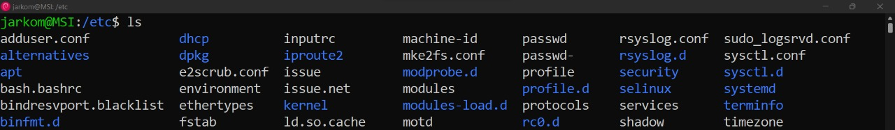

Ada beberapa macam perintah ls, contohnya ls -a dan ls -l

```
ls -a
```

ls -a berfungsi untuk menampilkan hidden file (file tersembunyi) dari direktori

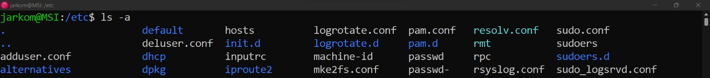

```
ls -l
```

ls -l berfungsi untuk menampilkan permission (ijin) dari file yang ada di dalam direktori

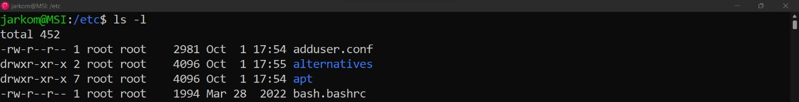

#### 2. pwd

```
pwd
//print working directory
```

Perintah pwd ini digunakan untuk menampilkan lokasi direktori saat ini

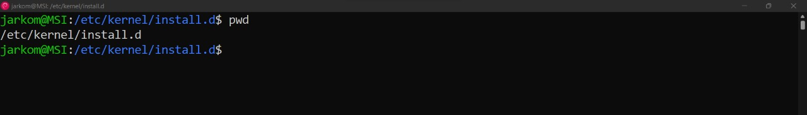

#### 3. cd dan cd..

```
cd [nama_folder]
cd..
//change directory
```

Perintah cd ini digunakan untuk pindah dari satu direktori ke direktori lain. Sedangkan perintah cd.. berfungsi untuk kembali ke direktori atasnya (bukan sebelumnya)

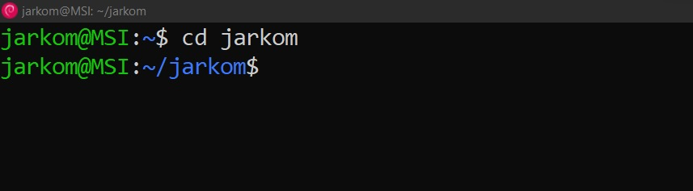

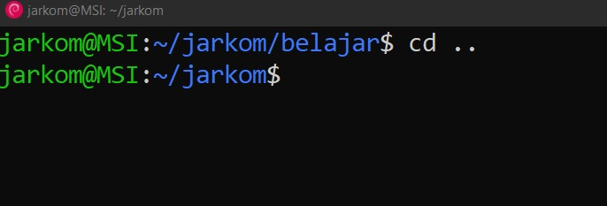

#### 4. mkdir

```
mkdir [nama folder]
//make directory
```

Perintah mkdir digunakan untuk membuat direktori baru

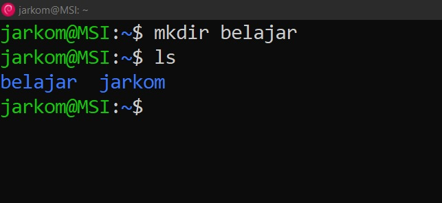

#### 5. touch

```
touch [nama file]
```

Perintah touch digunakan untuk membuat file kosong baru

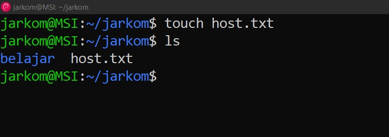

#### 6. cp

```
cp [nama_file] [nama_folder_tujuan]
//copy
```

Perintah cp digunakan untuk menyalin (mengcopy) file dari suatu direktori ke direktori yang diinginkan

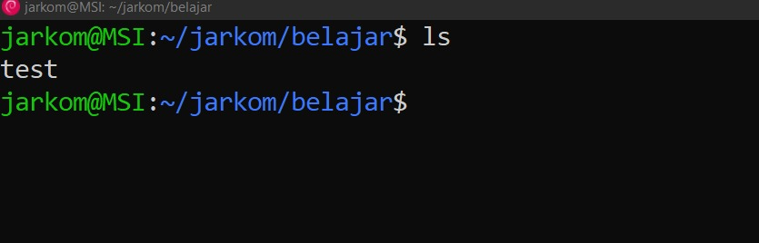

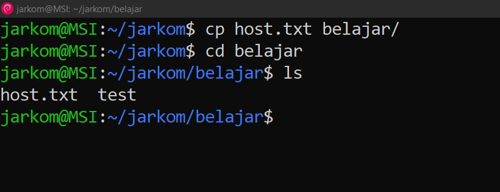

#### 7. mv

```
mv [nama_file/folder] [nama_folder_tujuan]
//move
```

Perintah mv diatas digunakan untuk memindahkan file/folder ke direktori yang diinginkan

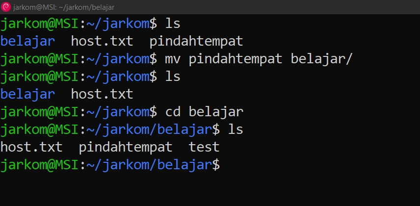

```
mv [nama_file/folder] [nama_file/folder_baru]
```

Perintah mv diatas digunakan untuk mengganti nama sebuah file atau folder

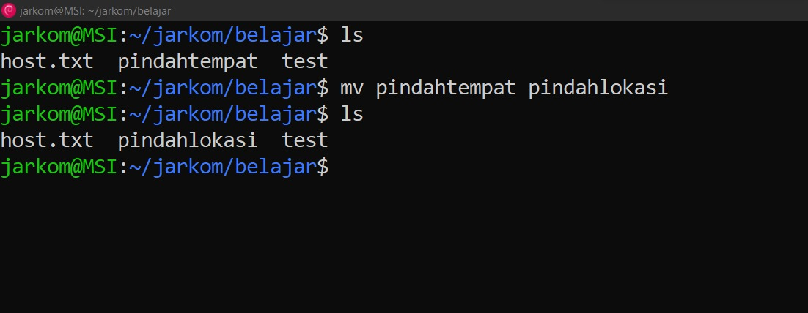

#### 8. rm

```
rm [nama_file/folder]
//remove
```

Perintah rm ini digunakan untuk menghapus satu atau lebih file pada direktori tersebut

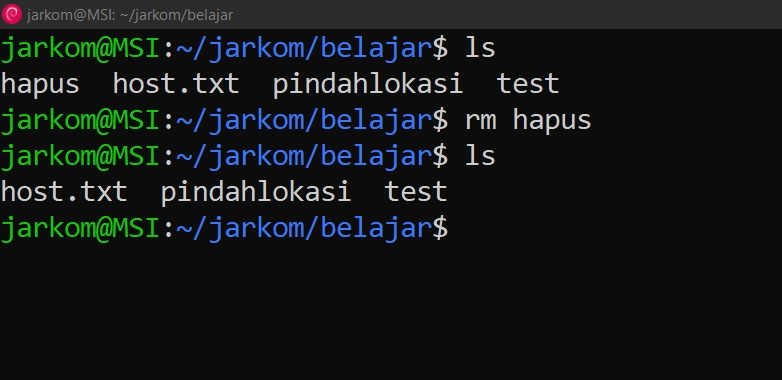

#### 9. chmod

```
chmod [kode_permission] dan [nama_file/folder]
//change mode
```

Perintah chmod digunakan untuk mengganti permission (ijin) dari sebuah file atau direktori

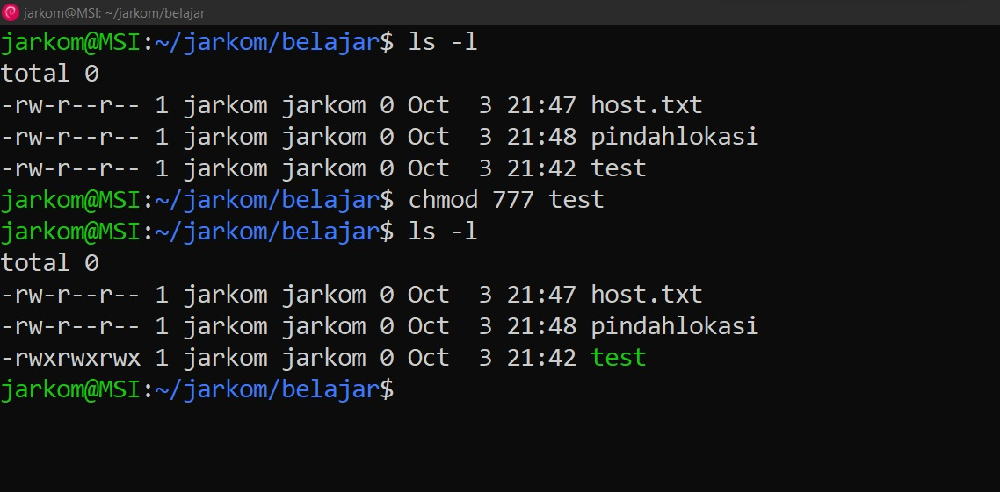

Perintah chmod memiliki 3 rute utama

- R (Read)
- W (Write)
- X (Execute)

Yang disediakan untuk 3 macam user

- O (Owner) --> Pemilik suatu file atau direktori
- G (Group) --> Sekelompok user
- P (Public) --> Selain dari owner dan group

Dengan aturan

- 4 --> Read
- 2 --> Write
- 1 --> Execute

Maksud dari chmod 777 dari gambar diatas adalah

- Mode 7 (angka pertama) untuk owner, yang didapat dari 4+2+1. Jadi owner dapat membaca file (read), menulis file (write), dan mengeksekusi fle (exeute) tersebut
- Mode 7 (angka kedua) untuk group, yang didapat dari 4+2+1. Jadi group dapat membaca file (read), menulis file (write), dan mengeksekusi fle (exeute) tersebut
- Mode 7 (angka ketiga) untuk publik, yang didapat dari 4+2+1. Jadi publik dapat membaca file (read), menulis file (write), dan mengeksekusi fle (exeute) tersebut

#### 10. chown

```
chown [user]:[group] [nama_file]
//change owner
```

Perintah chown digunakan untuk mengubah kepemilikan

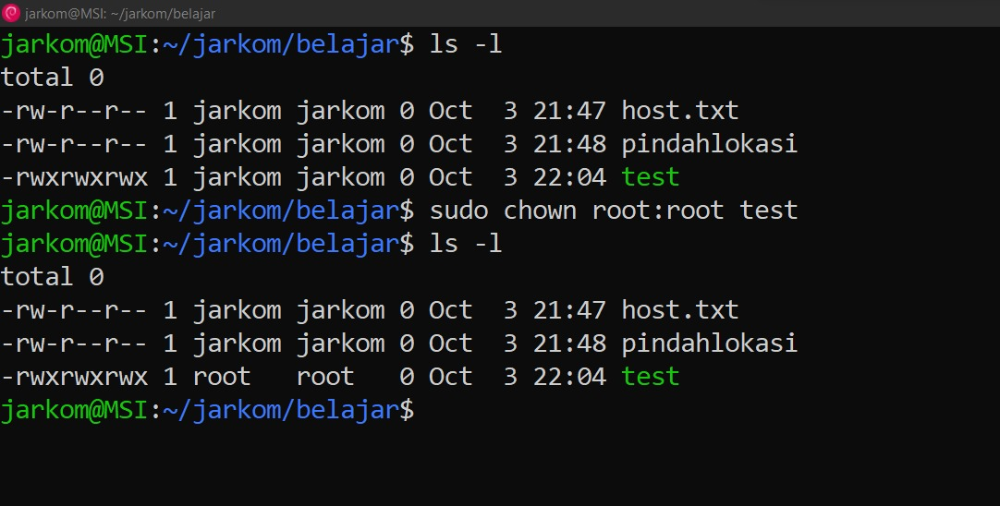

#### 11. nano

```
nano [nama_file]
```

Perintah nano digunakan untuk mengedit sebuah file dan membuat file baru jika file tersebut belum ada. Nano sendiri merupakan salah satu dari sekian editor terminal UNIX.


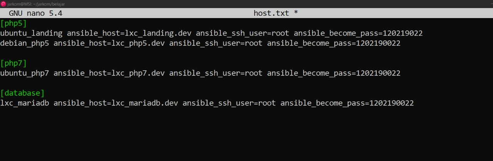

#### 12. man

```
man [command]
man print
//manual
```

Suatu saat jika butuh penjelasan/dokumentasi mengenai command line tertentu, bisa menggunakan perintah man. Misal mengetikkan "*man ls*". Maka terminal akan berubah menjadi manual

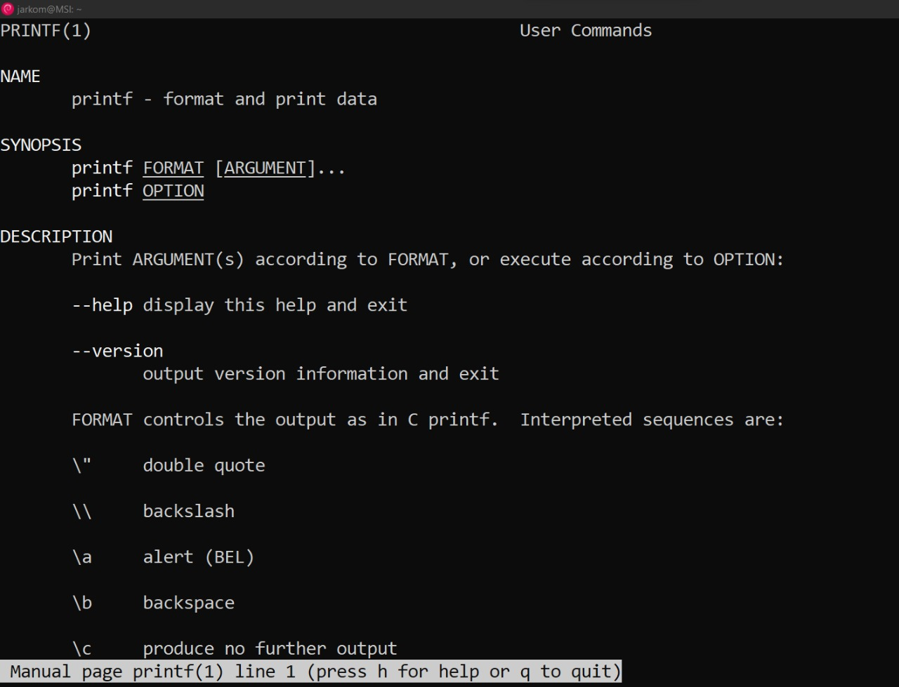

#### 13. apt-get

```
apt-get [perintah] [nama_paket]
```

Perintah apt-get digunakan untuk menginstall aplikasi di linux. Untuk menginstall suatu perintah 'sl' yang perlu dilakukan adalah update dan install

```
apt-get update
//agar list-list package terupdate
```

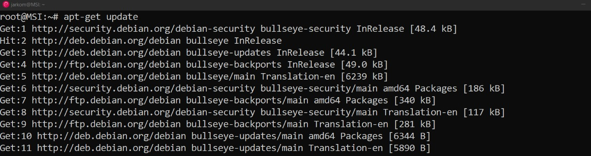

```
apt-get install sl
//menginstall sl
```

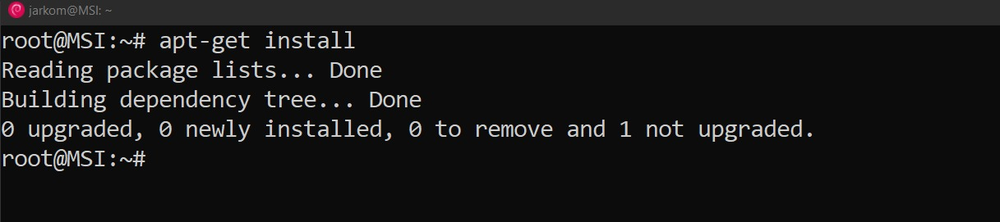

------

## Thank You